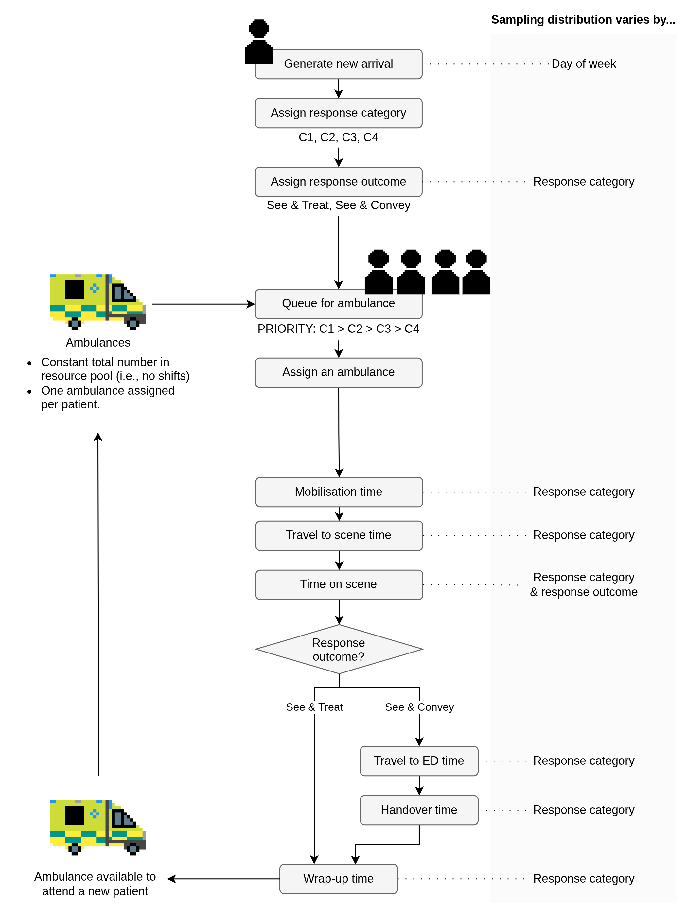

# ambdes: open reproducible discrete-event simulation of ambulance operations


This repository contains a discrete-event simulation (DES) model of ambulance operations, with supporting notebooks and documentation.

Documentation: <https://ambmodels.github.io/ambdes/>

## Model structure



## Setup

Dependencies are pinned in `pyproject.toml`. These can be installed using Python 3.13 and your preferred environment manager.

### Mamba

```bash
mamba create -n ambdes python=3.13.13
mamba activate ambdes
pip install -e .
```

### venv

On Windows:

```bash
py -3.13 -m venv .venv
.\venv\Scripts\activate
pip install -e .
```

On Linux or macOS:

```bash
python3.13 -m venv .venv
source .venv/bin/activate
pip install -e .
```

### Poetry

```bash
poetry env use 3.13
poetry install
poetry shell
```

### uv

```bash
uv venv --python 3.13
source .venv/bin/activate
pip install -e .
```

## Pre-commit

This repository includes a pre-commit hook that checks for the filename of real (private) data, which should never be used here. That analysis belongs in a separate, private repository. If you've accidentally referenced the real data file name in a staged file, the hook will detect it and block the commit, prompting you to remove it before processing.

To activate this hook after cloning this repository, run:

```
pre-commit install
```

## Documentation (local build)

```
great-docs build
great-docs preview
```

## Linting and formatting

This will run on all `.py` files and any `.ipynb` notebooks.

```
ruff format
ruff check --fix
```

## Tests

```
pytest
```

## Citation

See `CITATION.cff`.

## Acknowledgements

This work is part of the [STARS project](https://pythonhealthdatascience.github.io/stars/), supported by the Medical Research Council [grant number MR/Z503915/1] 

`WarmUpAuditor` based on [Length of warm-up](https://pythonhealthdatascience.github.io/des_rap_book/pages/guide/output_analysis/length_warmup.html) chapter from DES RAP Book, which itself adapts the auditor-based strategy from Tom Monks (2024) Lab 6 Output Analysis in [HPDM097 - Making a difference with health data](https://github.com/health-data-science-OR/stochastic_systems) (MIT Licence).