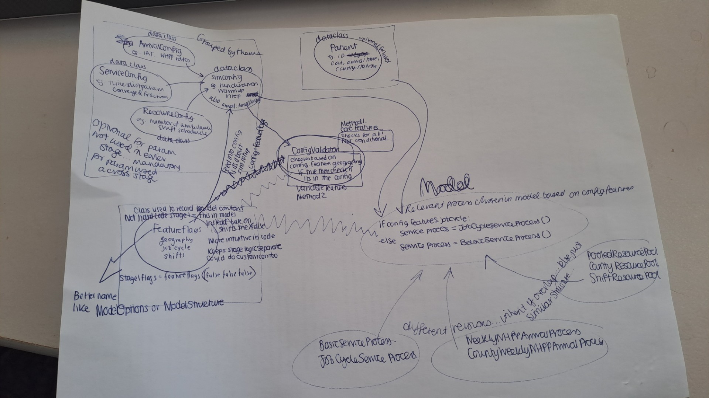

## Core tools

* Use **Python** (as ambulance team are familiar).
* Use **uv** for environment management, as it handles Python versions and dependencies, with a simple configuration and a lock file.
* Use **SimPy** for DES (as it is popular, taught on HSMA, and also should be familiar).
* Use **sim-tools** for distributions
* Use **vidigi** for animation

## Open and private workflow

* Structure the model code as a **public Python package**.
* Make the model documentation **public**.
* Use **dummy data** in the public repository for examples.
* Design the public package so it can be imported and run privately on local data. Ensure the public version reproduces all key analytical steps.

## Documentation

Use Quarto on GitHub pages for a single documentation site including the project specification, code documentation via **quartodoc**, and examples run on dummy data. This will include:

* User documentation explaining how to run and interpret the model
* Technical documentation explaining the model structure and implementation
* An ongoing record of data sources, assumptions, inputs, and decisions - including any changes to the analytical plan or decisions made during analysis
* [STRESS-DES items](https://github.com/ambmodels/ambdes/issues/13)
* Documentation requirements from the [PyOpenSci checklist](https://github.com/ambmodels/ambdes/issues/19)

Also maintain the following repository documentation:

* `README.md` (see [here](https://pythonhealthdatascience.github.io/des_rap_book/pages/guide/style_docs/documentation.html) for contents)
* `CONTRIBUTING.md` (see [here](https://pythonhealthdatascience.github.io/des_rap_book/pages/guide/style_docs/documentation.html) for contents)
* `CHANGELOG.md` - doing releases and archiving to Zenodo
* `LICENSE`
* `CITATION.cff`

Citation as per https://pythonhealthdatascience.github.io/des_rap_book/pages/guide/sharing/citation.html

## Code design

Use an **object-oriented** design.

Have a **logging** system in place which can enable/disable. Shouldn't slow it down too much! Be wary of that. Ensure address things raised in NHS model reuse interviews e.g. broad logging messages as run.

Once run times get longer, use **parallel** processing.

Provide a **single-command mechanism** to run everything end to end.

::: {.box-hl}

Will require some thought around how best to design modular components that can be **easily swapped or extended**. Some duplication will be inevitable, so the aim should be to minimise it with a clear and maintainable structure. Something like:

\

Also, review whether current **scenario** approach could be improved, as can feel a little clunky.

Consider how could improve **speed**... monitor speed as build - identify what slows it down

:::

## Inputs

Possible input formats:

* Excel workbook - proprietary but standard
* CSV
* JSON - not well liked in NHS model reuse interviews

## Quality and style

* Use **type hints**.
* Use **NumPy-style docstrings**.
* Use **ruff** for linting.
* Use **lintquarto** for linting the quarto site, and the image alt-text linter action.
* Include a linting **CI/CD** GitHub action.

## Testing

* Write tests with **pytest**.
* Run tests through **CI/CD**.
* Include a **test coverage** action.
* Arrange tests by theme, then use **pytest markers** for test type. se language from our training to describe them.
* Include a **smoke test** as a gate.

## Version control

* Use `dev` and `main`.
