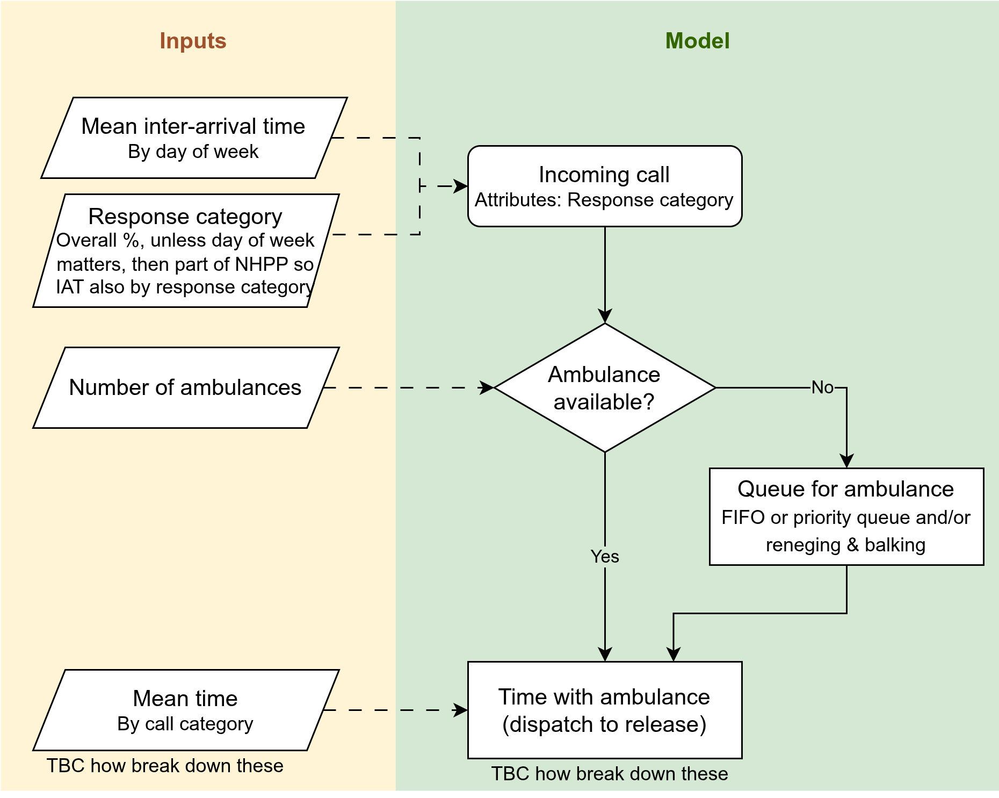
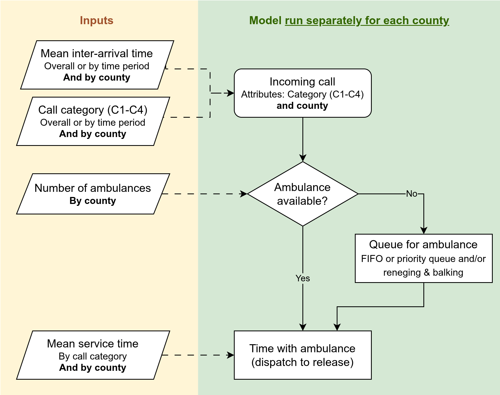
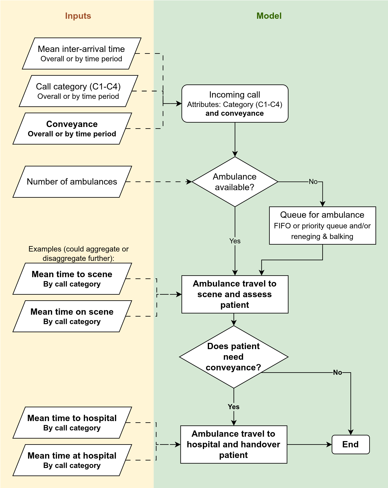
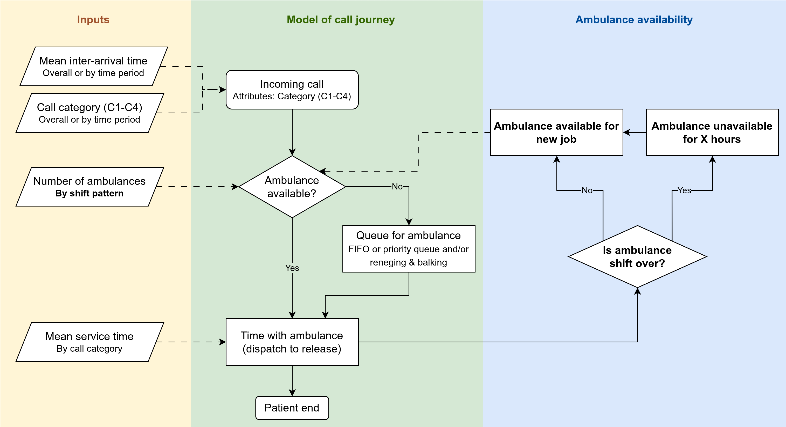
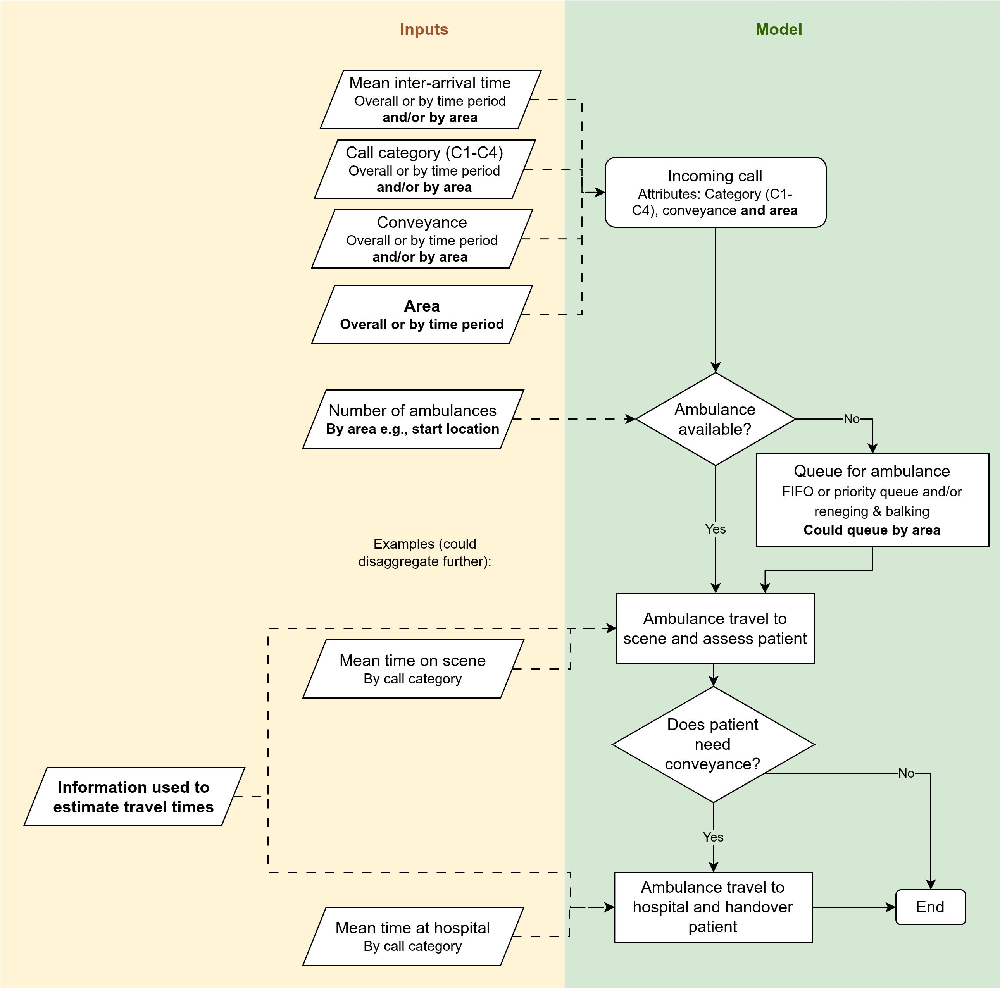
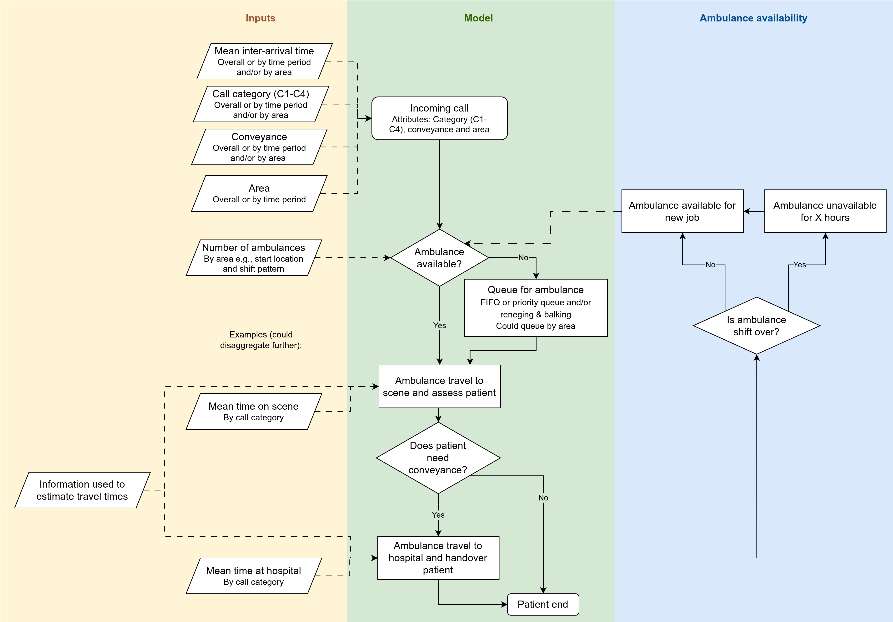

 

The proposed approach begins with a simple prototype and builds up in stages. **Each stage aligns with specific use case proposed by the ambulance service**. Within each stage, we define:

* The key question(s) being asked.
* Model content and inputs, including optional layers of complexity.
* Outputs.

Progressing through the stages, we can evaluate whether the added detail improves the model's validity for previous questions, or whether the simpler version remains sufficient.

 

## Stage 1: Whole-system resourcing

### Key question

::: {.box-blue}

How do changes in total vehicle hours affect Category 2 mean response time and resource utilisation?

:::

### Model content and inputs

| Element | Model content | Input |
| - | -- | -- |
| Arrivals | Basic arrival process or NHPP based on observed patterns | By call category, mean inter-arrival time for whole system OR mean by period of time |
| Call category | Separate arrival times - part of arrival distribution or assigned after | If NHPP is used and we want to do call category by time period, it should be sampled as part of NHPP too. If don't want call category probabilities to be by time period, then can just assign them using another probability distribution afterwards |
| Resource | Single pooled ambulance resource | Number of ambulances for whole system |
| Queue | First come first serve or prioritisation rules with potential reneging/balking | Priority rules could likely be informed by call guidelines |
| Service time | Single time (disatpch to resource available) | Mean time, by call category |

For initilalisation bias, use warm-up (as initial conditions can be complicated to find). Determine appropriate length of warm-up programmatically.

For uncertainty, use replications (as more intuitive than long run). Determine number of replications programmatically.

For distributions used, will do input modelling.

**Outputs:**

* **Primary:** Category 2 mean response time
* **Secondary:** Resource utilisation

Give results per run
And overall across reps
Can quantify uncertainty via 95% confidence interval (or could do prediction interval)

### Notes

This stage can serve as a benchmark against the current regression models. The DES version should broadly agree with regression estimates, while offering richer outputs. Regression is simpler, faster and easier to validate. However benefits of DES are:

* Multiple outcomes from the same run (regression just one per model).
* More intuitive system representation (can "see" how resourcing assumptions translate into waits and utilisation).
* Extendability (once core structure is in place, we can add more components in later stages).

::: {.box-hl}

**To discuss:**

* To answer this question, do we need to report by whether **conveyed or not?** In which case, need to incorporate here (rather than stage 3).
* Relatedly, when consider conveyance, is it about:
    * **Conveyed v.s. Non-conveyed** (hear-and-treat and see-and-treat), or
    * **Conveyed v.s. Hear-and-treat v.s., See-and-treat**
* Does ambulance service have any **existing analysis looking at trends in call arrivals**? Want to understand what the hour / day of week variation is. Likewise, for call categories by time period.

:::

 

## Stage 2: Resourcing by county (without interaction)

### Key question

::: {.box-blue}

If total vehicle hours change in a specific county, how do Category 2 response times and utilisation change within that county?

:::

Done on county level as that lines up with organisational structure
Although is coming up more in conversations about the hospital level as thats where they go

### Model changes

| Element | Description |
| - | --- |
| Content | Same as stage 1 |
| Inputs | County-specific parameters for demand, resources and service times |
| Outputs | Same as stage 1 |

*This is equivalent to having one model instance with separate ambulance resources per county, as then you'd just be running each county in parallel to each other essentially, no interaction, so it's simpler to just use the single area model and run it for each county.*

### Notes

This will only be an approximation, and may potentially be quite bad. It ignores how counties ineract - we know there isn't really one separate service per county, and that resources operate across counties on shift.

::: {.box-hl}

**To discuss:**

* **Is this actually a question of interest?** Or is it really just stage 5? Maybe should remove this?

:::

 

## Stage 3: Job cycle times

### Key question

::: {.box-blue}

How do improvements in specific job-cycle components (e.g., scene time, handover) affect response time and utilisation?

:::

### Model changes

| Element | Description |
| - | --- |
| Content | (1) Job cycle divided into individual time components (e.g., time on scene, handover time). (2) Separate cfycle times for conveyed v.s. non conveyed |
| Inputs | Cycle times and conveyed/nonconveyed breakdown of everything |
| Outputs | Also now report by conveyed and non conveyed |

### Notes

::: {.box-hl}

**To discuss:**

* Does this continue from stage 1 or 2? I guess it depends if stage 2 is any good or not?
* Which job cycle times to model? Which to **aggregate**?

:::

 

## Stage 4: Shifts

### Key question

::: {.box-blue}

Can alternative shift patterns (start times, staggering, breaks) smooth resource availability and improve response time and utilisation?

:::

Current patterns is that many 12-hour shifts starting at 06:00 or 07:00. This means there are:

* Midday and midnight dips in resource numbers when many crews are on break at once.
* Effects of protected periods towards the end of shifts.

The focus here is on whether alternative rota patterns smooth the resource availability profile and improve response time and utilisation.

### Model changes

| Element | Description |
| - | --- |
| Content | Add representation of shifts (resource availability over time), including breaks and protected periods |
| Inputs | Current and alternative rota schedules (for the whole area, not by station, proportions on different schedules) |
| Outputs | Add a new output: resource availability profile over the day (to see whether staggered shifts remove midday and midnight dips). |

### Notes

::: {.box-hl}

**To discuss:**

* Does this question require understanding of **county** (stage 2) or **job cycle** (stage 3). If so, it builds on them. If not, it builds on stage 1.
* Relatedly, if stages 2-4 are all just iterations on stage 1, **what is the priority order?**
* **What are the current break policies?**
* Is it relevant to know **proportion of crews going straight from one job to the next versus returning to station between jobs**? Here or elsewhere?
* Also, is it relevant here (or elsewhere) to think about other outcomes relevant to wellbeing or finances like **overtime** and **interruption of breaks**.
* Outcomes and scenarios explored here - explore **involving paramedics**? As there is a big wellbeing aspect to this. Like PPI, but specifically involving paramedics, as it would impact them if decisions made. Do they already do that for decisions? (e.g., chatting with Luke, frequently stuck on overtime due to late cat1, and always never return to base always straight to next job)
* **Cost**... I think this is maybe stage where starts to be relevant? You could attach simple cost estimates (e.g. staff and vehicle costs) to each resourcing or shift scenario + overtime etc. Purpose would be to understand cost implications of options that improve performance. Maybe its relevant to stage 1 and 2 as well though - high level estimate of operating cost under different scenarios

:::

 

## Stage 5: Resourcing by county or smaller (with interaction)

### Key question

::: {.box-blue}

When vehicle hours change in one county, how are response time and utilisation affected both locally and in neighbouring counties?

:::

### Model changes

This builds on stage 3, as we have travel times to scene and to hospital, and then job cycle times at scene and at hospital.

Introduce geographic modelling. Possible configurations:

* Counties as zones with local queues and spillover rules.
* Breaking down into smaller than county level

Resources become linked to area.

Brings with it possible changes to e.g., travel times (as can estimate now based on distance), and demand profiles (e.g., vary by area)

### Notes

::: {.box-hl}

**To discuss:**

There will be alot to figure here about how to do things, but can address at later stage.

* E.g. Whether do **times, catetgories and conveyance by area**.
* Where ambulances **start from and where they go** after release.
* How we model **travel times**.

Other things to consider would be:

* What **size area** is required to answer this question?
* Does this question require **shifts** in the model?
    * If yes, it builds from stage 4 (as represented in current diagram), If no, it builds from stage 3.
* **Socioeconomic inequalities**...

:::

::: {.callout-note title="Socioeconomic inequalities" collapse="true"} 

Either with stage 5 (though may be too broad) or 6.

Could explore outcome of not just reducing overall response time, but about gaps in response time between more and less deprived? Although, in this case, sometimes it's about rurality rather than socioeconomic - with actually better response times for lower SES.

 

**Literature:**

 

**@demir_using_2024** - **SimulEQUALITY framework** - DES of NHS hospital - "patients' characteristics and their healthcare system interactions can vary according to their SES, leading to differences in resource utilisation, such as LoS, between individuals who are deprived and more affluent" - they create a model following this structural hierachy:

* Level 1 - percentage of patients for outpatient care, inpatient admission, and ED
* Level 2 - assign specific department or specialty based on how patient entered
* Level 3 - assigned SES using IMD
* Level 4 - assigned distributions (param + type), variables, attributes, etc. based on SES

Result example is that they find paediatric inpatient admissions are highest for children in second most economically disadvantaged group. Forecast increased demain, compounding this. It could diminish care quality, leading to adverse health outcomes, especially for disadvantaged. So, they explore scenarios for reducing backlog of patients. They also attach costs.

 

**@madia_socioeconomic_2025** - analyses inequalities in access to emergency care (at Addenbrookes in Cambridgeshire).

* Referral source - not IMD - drives ED performance outcomes (length of stay, 4-hour breach, unplanned returns). Once you account for how patient entered the system, deprivation-level differences largely disappear
* Ambulance:
    * Patients from most deprived areas are more likely to arrive by ambulance (even after adjusting for demographic, clinical and contextual variables).
    * Ambulance utilisation highest in middle-deprivation areas.
    * Ambulance referrals had longest ED stays and highest probability of 4-hour breaches.
* Non-medical referrals (mainly police/forensic) higher for deprived areas.
* GP referral higher in non-deprived.

Reflections:

* Deprivation gradients in our area may look different.
* By modelling ambulance calls across geographic areas, we are implicitly modelling inequality, as deprivation shapes who ends up in the ambulance pathway, so **if our areas vary by IMD, our arrival rates are already an inequality signal**.
* You could ask questions related to inequality such as:
    * What is NHS 111 uptake increased in deprived areas? i.e., Reduced ambulance arrival rates for lower acuity cases in high deprivation areas.
    * What if GP access improved in deprived areas? i.e., Shift some demand out of ambulance pathway.
* The **ED waits observed in our model are an inequality outcome indicator**.

We could **tag arrivals by deprivation band (based on their area) - meaning we could report equity breakdowns (e.g., response time by IMD)**.

 

<https://aace.org.uk/reducing-health-inequalities/>

[Implementation toolkit](https://aace.org.uk/wp-content/uploads/2026/01/Health-inequalities-implementation-toolkit-FINAL-v3-31-Dec-2025.pdf): Data insight, evidence and evaluation.

* Ambulance services and systems use ambulance data to better understand population health and health inequalities.
* Ambulance services work to improve the evidence-base that supports and informs the role of the ambulance sector in reducing health inequalities.
* Ambulance services work in collaboration witht heir local systems to better understand the needs of their communities through improved engagement, insight and patient experience.

Examples in practice:

* Routinely use population health data to better understand the needs of vulnerable population groups
* Establish direct access to analysts trained in public health who routinely influence service design/delivery
* Regularly undertake health inequalities research, implement changes based on the results
* Regularly review data on equity of access, experience and outcomes and use to influence decision making

[What we know](https://aace.org.uk/wp-content/uploads/2023/06/AACE-NHSE-RHI-WHAT-WE-KNOW-JUNE-2023-F2.pdf)

Yorkshire Ambulance Service NHS Trust (as of June 2023) were undertaking a scoping review looking at what ambulance services understand about health inequalities in patients who have any of the characteristics described in the Core20PLUS5 approach for adults. Preliminrary themes:

Copied from report:

Ambulance access and usage:

* Women, CYP and those of Latino ethnicity less likely to call 911
* Higher rate of EMS calls in deprived areas and with high BAME population
* Ethnic minorities less likely to travel to hospital by ambulance
* Areas without ambulance provision over-represented by indigenous people
* Higher incidence of chest pain, children with traumatic injurices and stabbings in males in most deprived areas
* Higher incidence of out of hospital cardiac arrest for increasing age, sex ratio, diabetes prevalance, deprivation and ethnic concentration
* Higher risk of injury by road traffic collision in regional areas
* Emergency operations centre staff took longer to recognise cardiac arrest with limited English proficient callers

Ambulance times:

* Longer response times for areas of high deprivation and rurality (though other studies found shorter response times for those of BAME origin)
* Longer on scene time with increased age and for females

Ambulance assessment and treatment:

* Disparities in analgesia administration based on age and ethnicity
* Automated Externel Defibrilators more likely to be present in less deprived areas
* Black individuals less likely to receive defibriliation or CPR
* Less likely to give aspirin, GTN, perform ECG and gain intravenous access in women compared to men

Outcomes:

* Survival from OOHCA decreases with age in females, whereas younger men have relatively lower survival compared to older men until age 65
* Lower likelihood of transport to specialist receiving facility with increased age and ethnic minority and female
* Different hospital desination depending on racial group
* Odds of surviving OOHCA lower in rural areas
* Males in OOHCA without return of spontaneous circulation more likely tobe transported to hospital than females
* Higher levels of deprivation associated with lower acuity patients transported to emergency department
* Lower levels of stroke recognition amongst Hispanic patients

 

@portz_rising_2013

 

@turner_socioeconomic_2022

 

@leeds_institute_for_data_analytics_assessing_2025

:::

 

## Stage 6: Station-level questions

### Key question

::: {.box-blue}

What is the impact of adding/moving/removing individual station shifts?

:::

For example, identifying stations with low utilisation, as candidates.

### Model changes

This requires representing individual stations explicitly. And linking resources to those.

It requires stage 4 and stage 5 components and essentially merges those. Depending on how model a station and what incorporate in stage 5, may not be super different. Just requires **sufficiently small areas** to represent different stations.

### Notes

::: {.box-hl}

**To discuss:**

* Depends on stage 5, whether this is new or not.
    * New if stage 5 is big areas.
    * Not a stage if stage 5 already requires small areas.

:::

 

## Assumptions and simplifications

To reflect on and document. Things like:

* Multiple vehicles attending the same incident - not modelling that (should you?)
* Including/excluding see-and-treat and hear-and-treat
* Out of ambulance service patch
* Not modelling hospital capacity (AmbModelOpen did that)
